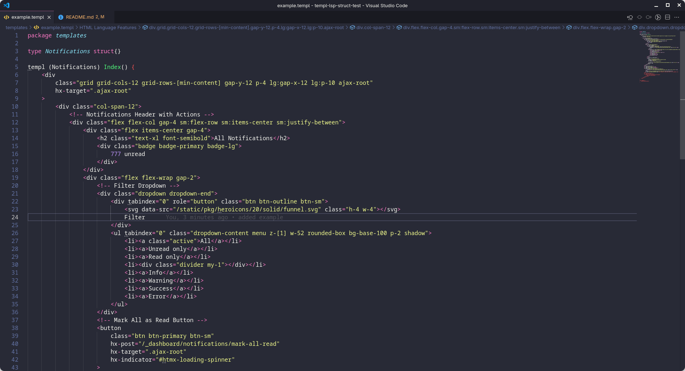
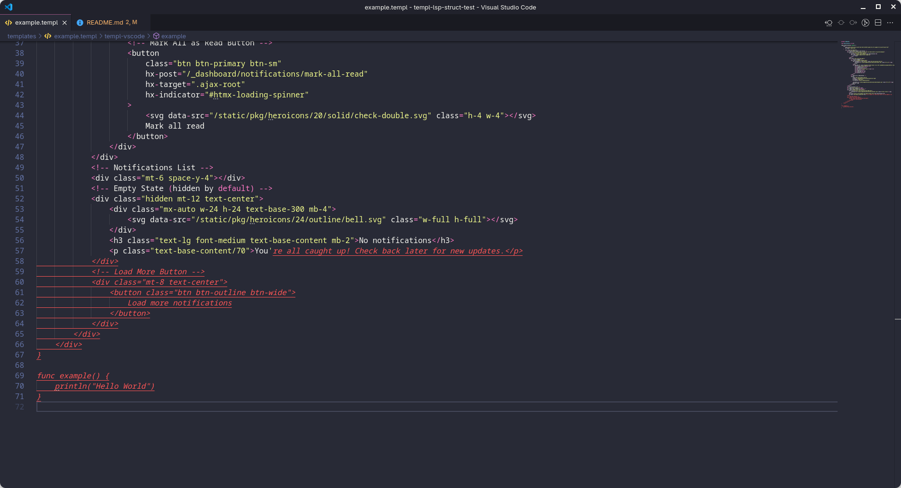
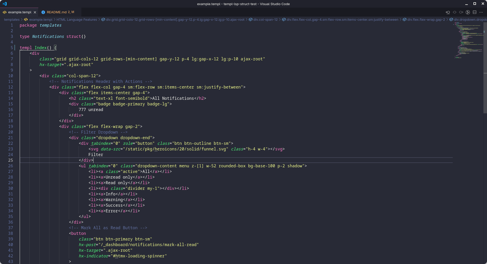
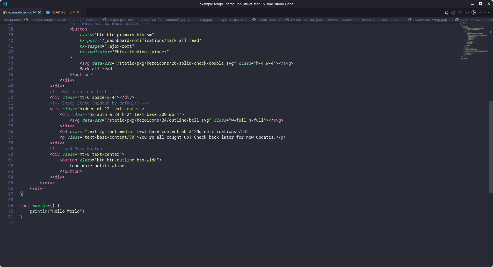

**Describe the bug**
A clear and concise description of what the bug is.

**To Reproduce**
A small, self-contained, complete reproduction, uploaded to a GitHub repo, containing the minimum amount of files required to reproduce the behaviour, along with a list of commands that need to be run. Keep it simple.

**Expected behavior**
A clear and concise description of what you expected to happen.

**Screenshots**

struct example:



function example:



**Logs**
If the issue is related to IDE support, run through the LSP troubleshooting section at <https://templ.guide/developer-tools/ide-support/#troubleshooting-1> and include logs from templ

**`templ info` output**

```
(✓) os [ goos=linux goarch=amd64 ]
(✓) go [ location=/usr/bin/go version=go version go1.24.5 linux/amd64 ]
(✓) gopls [ location=/home/me/go/bin/gopls version=golang.org/x/tools/gopls v0.20.0 ]
(✓) templ [ location=/home/me/go/bin/templ version=v0.3.924 ]
```

**Desktop (please complete the following information):**

- OS: Linux fedora 6.15.9
- templ CLI version v0.3.924
- Go version go1.24.5
- `gopls` version v0.20.0

**Additional context**
Add any other context about the problem here.
